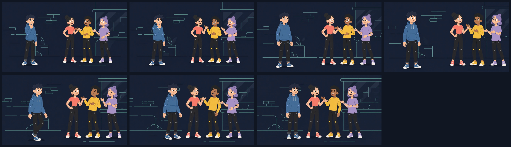

# Completed Storyboard — How to Join a Group Conversation Without Interrupting

## Project

- **Title:** How to Join a Group Conversation Without Interrupting
- **Visual master:** `01_hook.mp4` (1280 × 720, 24 fps, 8.000 s, one continuous locked-off wide shot)
- **Character continuity reference:** `360036.png`
- **Total narration duration (generated):** ~6:32; script target 8:02
- **Canvas:** 1280 × 720, 16:9 landscape
- **Storyboard type:** Reference-preserving. No new scenes, redesigns, camera moves, cuts, or on-screen graphics are introduced. Every panel below re-uses one of the seven frames extracted from the reference video and is described only by which reference beat holds behind that narration segment.

## Reference contact sheet

The seven panels above (top row: frames 01–04; bottom row: frames 05–07) are the entire visual pool for this storyboard. Every panel below reuses one of them.

## Visual pool (locked)

| Ref frame | Timecode in `01_hook.mp4` | Held state |
|---|---:|---|
| frame_01.png | 00:00.00 | Protagonist alone in left third, hand near chin, hesitant. Group on right, mid-conversation. Maximum negative space between them. |
| frame_02.png | 00:01.33 | Protagonist still apart but more attentive; group continues distinct coral/yellow/lavender gestures. |
| frame_03.png | 00:02.67 | Protagonist upright, arms less closed. Group open, conversational. |
| frame_04.png | 00:04.00 | Protagonist has stepped closer but is clearly separate. Central negative space is narrowing. |
| frame_05.png | 00:05.33 | Protagonist near the group, standing more confidently. Group facing inward and toward him. |
| frame_06.png | 00:06.67 | Protagonist integrated into the group's immediate space, relaxed. |
| frame_07.png | 00:07.96 | Resolution: protagonist smiling close to the group; group smiling and gesturing in welcoming exchange. |

Background remains dark navy with mint/cyan architectural line art (brick marks, potted plant, window/door area, stairs) in every panel. Circular joint markers stay attached to every limb. Wardrobe colors stay blue / coral / yellow / lavender. No text, logos, props, or new characters appear.

## Character continuity (applies to every panel)

- **Protagonist** — short dark navy hair, round expressive eyes, blue hoodie, dark trousers, blue-and-white sneakers, blue joint accents.
- **Coral character** — dark hair in a bun, coral shirt, dark trousers, coral-and-white sneakers, coral joint accents.
- **Yellow character** — dark curly hair, yellow shirt, dark trousers, yellow-and-white sneakers, yellow joint accents.
- **Lavender character** — lavender hair, lavender shirt, dark trousers, lavender-and-white sneakers, lavender joint accents.

Expressions follow the reference progression only: protagonist hesitant → relaxed; group conversational → welcoming. No new expressions are introduced.

---

## Storyboard panels per narration segment

Each panel names the dominant reference frame that holds under that narration span, the emotional anchor for the audience, and the continuity check the compositor should verify before locking picture.

### Panel 01 — Hook (00:00 – 00:18)

> "You don't have to interrupt to join a group conversation. You only need to find the gap that is already there."

- **Held visual:** `frame_01.png` (with `frame_02.png` as an optional micro-hold on the second sentence).
- **Emotional anchor:** The one-sided distance is the entire premise. The negative space between the protagonist and the group is the "gap" the narrator names.
- **Audio bed:** hook narration (`hook_narration.wav`) over the ducked lo-fi bed (`hook_music.wav`), matching `final_hook_mix.wav`.
- **Continuity check:** All four characters recognizable at their first appearance; joint markers visible; camera locked; no title card added.

### Panel 02 — Validate the problem (00:18 – 00:58)

> "You walk over to a group, and suddenly everyone seems to be talking at once… you are still standing there with the perfect sentence that arrived thirty seconds too late."

- **Held visual:** `frame_02.png` as the dominant hold; brief return to `frame_01.png` on "So you wait. And wait."
- **Emotional anchor:** The protagonist is watching, not moving. Coral, yellow, and lavender continue an animated exchange the protagonist can't enter.
- **Audio bed:** `narration_02_validate.wav` over the same bed at conversational level.
- **Continuity check:** Group members remain distinct in silhouette and color; protagonist's hand stays near chin or lowered — no new gesture is added.

### Panel 03 — Reframe (00:58 – 01:35)

> "Joining a group is less like taking a stage and more like stepping onto a moving walkway… I call this the Three-Second Bridge."

- **Held visual:** `frame_03.png` — the first frame in which the protagonist's posture opens.
- **Emotional anchor:** The idea of a bridge is visualized by the protagonist's stance beginning to face the group rather than the void beside him.
- **Audio bed:** `narration_03_reframe.wav`.
- **Continuity check:** Posture change reads as a pose shift, not a redesign. Background line art unchanged. No graphic overlay for "Three-Second Bridge."

### Panel 04 — Step one: listen for a gap (01:35 – 02:25)

> "First, listen for a gap… A group that leaves space, looks outward, or pauses between speakers is easier to enter."

- **Held visual:** `frame_03.png` continuing, transitioning to `frame_04.png` at the "watch the group's body language" beat.
- **Emotional anchor:** The protagonist is reading the group. The narrowing central negative space in `frame_04.png` mirrors "soft landing point."
- **Audio bed:** `narration_04_listen.wav`.
- **Continuity check:** Group's inward-facing composition on the right is preserved; protagonist has not yet crossed into the group's space.

### Panel 05 — Step two: acknowledge the topic (02:25 – 03:20)

> "Second, acknowledge what is already happening… You are showing that you are paying attention to the story that already exists."

- **Held visual:** `frame_04.png` as the dominant hold; a short return to `frame_03.png` on each of the three example lines ("terrible commute", "movie", "I clearly missed a chapter") so the beat rhymes with hesitation before the acknowledgment.
- **Emotional anchor:** The protagonist is close enough to be seen by the group but has not yet spoken.
- **Audio bed:** `narration_05_acknowledge.wav`.
- **Continuity check:** No speech bubbles, captions, or on-screen quote treatment — the acknowledgment lines are audio only.

### Panel 06 — Step three: add one small connection (03:20 – 04:25)

> "Third, add one small connection… A good entry is not a monologue. It is a handoff."

- **Held visual:** `frame_05.png` — the approach/entry beat.
- **Emotional anchor:** The protagonist is now inside the conversational orbit; the group's gestures open toward him.
- **Audio bed:** `narration_06_connect.wav`.
- **Continuity check:** Left-to-right staging preserved. The group does not turn away or reshuffle order (coral left of yellow left of lavender remains true).

### Panel 07 — The mistake to avoid (04:25 – 05:30)

> "The biggest mistake is trying to prove that you deserve to be in the conversation… You can say, 'Anyway, I'll let you get back to it,' and leave without making it strange."

- **Held visual:** Return to `frame_02.png` on "talking too much / explaining why you came over" (the pre-entry state), then advance back to `frame_05.png` on "It is a moment of mutual availability."
- **Emotional anchor:** The single deliberate step backward in the storyboard mirrors the narrator's cautionary content. It is a beat re-use, not a new shot.
- **Audio bed:** _narration_07_mistake.wav_ (to be generated with the same voice profile — Achird, warm adult male — used for segments 01–06).
- **Continuity check:** The step "back" is achieved only by holding an earlier reference frame; no reverse motion is animated. Sneaker colors, hoodie color, joint markers unchanged.

### Panel 08 — Three practical entry lines (05:30 – 06:42)

> "Here are three low-pressure lines you can adapt… Let someone else pick up the thread."

- **Held visual:** `frame_05.png` as the dominant hold, with a soft cut to `frame_06.png` at each of the three lines ("I caught the part about…", "Okay, I need the context.", "I have a quick version of that.").
- **Emotional anchor:** The protagonist is inside the group; the three-line rhythm is carried by the group's open gestures rather than by any new prop.
- **Audio bed:** _narration_08_lines.wav_ (to be generated).
- **Continuity check:** No text overlay of the three example lines. No numbered graphics. The listing rhythm is audio-only.

### Panel 09 — Practice plan (06:42 – 07:35)

> "Here is your practice for the next week… Often, they are the people who notice what is happening, respect the rhythm, and make the next person feel comfortable speaking."

- **Held visual:** `frame_06.png` — protagonist integrated, relaxed.
- **Emotional anchor:** Instruction lands after the transformation is visually complete. The audience sees "make your presence easy to include" as an already-achieved state.
- **Audio bed:** _narration_09_practice.wav_ (to be generated).
- **Continuity check:** Group's four-person composition is stable; nobody has left frame; no new characters introduced.

### Panel 10 — Closing (07:35 – 08:02)

> "So the next time you see a group conversation, remember the Three-Second Bridge: listen, acknowledge, connect. You are not interrupting the conversation. You are giving it one more place to go."

- **Held visual:** `frame_07.png` — resolution frame.
- **Emotional anchor:** Final smile as the narration lands on "one more place to go." The frame is the payoff of the opening negative space collapsing.
- **Audio bed:** _narration_10_closing.wav_ (to be generated). Music bed swells slightly under the last sentence and fades to silence at 08:02.
- **Continuity check:** Final held frame matches the resolution beat of the reference video exactly — no added logo, sign-off text, or endcard.

---

## Segment-to-audio map

| Panel | Narration span | Audio asset | Status |
|---|---|---|---|
| 01 | 00:00 – 00:18 | `hook_narration.wav` + `hook_music.wav` → `final_hook_mix.wav` | Delivered |
| 02 | 00:18 – 00:58 | `narration_02_validate.wav` | Delivered |
| 03 | 00:58 – 01:35 | `narration_03_reframe.wav` | Delivered |
| 04 | 01:35 – 02:25 | `narration_04_listen.wav` | Delivered |
| 05 | 02:25 – 03:20 | `narration_05_acknowledge.wav` | Delivered |
| 06 | 03:20 – 04:25 | `narration_06_connect.wav` | Delivered |
| 07 | 04:25 – 05:30 | `narration_07_mistake.wav` | Pending — same voice/profile |
| 08 | 05:30 – 06:42 | `narration_08_lines.wav` | Pending — same voice/profile |
| 09 | 06:42 – 07:35 | `narration_09_practice.wav` | Pending — same voice/profile |
| 10 | 07:35 – 08:02 | `narration_10_closing.wav` | Pending — same voice/profile |

The concatenated `full_narration.wav` already covers spans 01–08 of the script as noted in the production notes (~6:32 total). Panels 09 and 10 above still need their own spans generated to reach the 8:02 target.

## Visual assembly notes

- **Reference reuse only.** Every held visual is one of the seven extracted frames. No new frames are painted, generated, or interpolated.
- **Frame holds and micro-returns are not cuts.** The reference video is one continuous locked shot. Holding a chosen frame across a narration span, or briefly returning to an earlier one, is an editorial hold on the same shot — no new camera move is introduced.
- **Timing resolution stands.** The production package still contains both the eight-second reference-preserving hook cut (`final_reference_narrated_hook.mp4`) and the longer generated narration. Assembling the full 8:02 program requires the editorial decision noted in the technical report — this storyboard specifies which reference beat holds under each narration span so that whichever assembly method is chosen (extended hold cadence, ken-burns-free frame sequence, or a separately approved re-cut) can proceed without re-designing any character or scene.
- **Audio-only lists.** The three-line and three-step enumerations in the script are carried entirely by narration; no on-screen numbering, captions, or lower-thirds are added.
- **Background integrity.** In every panel the dark navy background and mint/cyan brick / plant / window / stairs line art remain identical to the reference. Any drift in line weight, palette, or geometry is a continuity failure.

## Delivery checklist

- [ ] All ten panels above match their listed reference frame.
- [ ] Narration audio for panels 07–10 generated with the Achird / warm adult male profile matching panels 01–06.
- [ ] Music bed ducked under narration and faded at 08:02.
- [ ] Final mux uses the reference H.264 stream unchanged wherever the reference frame is on screen.
- [ ] Character continuity checklist in `Character_Continuity_Checklist.md` passes for every panel.
- [ ] No text, logos, props, or new characters appear in any panel.
